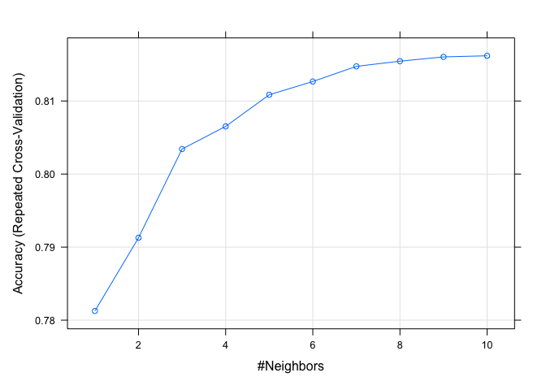

Credit-Card_Classifier
================
Willy Feid
2023-09-08

``` r
library("tidyverse")
library("skimr") # skim function
library("readxl") # used to read excel files
library("readr") # read csv
library("dplyr") # data munging 
library("FNN") # knn regression (knn.reg function)
library("caret") # various predictive models
library("class") # confusion matrix function
library("rpart.plot") #plot decision tree
library("rpart")  # Regression tree
library("glmnet") # Lasso and Ridge regression
library('NeuralNetTools') # plot NN's
library("PRROC") # top plot ROC curve
library("pROC")
library("ROCR") # top plot lift curve
```

# 1. Project Summary

Situation: A credit card company only wants to extend credit card offers
to people with an income above \$50,000. Thus, the main criteria is that
the person must have a projected income above \$50,000 and your
predictive model uses income as the target variable.

Goal: The goal is to maximize profit given the benefits of the true
positives and true negatives, and the costs of the false positives and
the false negatives. ● The benefit of a true positive is equal to the
lifetime value of a credit card customer, estimated to be \$1400 ● If
you incorrectly give a person a credit card (false positive) and the
person defaults, and it goes into collection then you can lose not only
the principal but also have a cost of collection. This is estimated to
be a loss of \$1200 ● Not issuing a card to a person who would have been
a good customer (false negative) is an opportunity lost. Missing out
this opportunity costs \$800 ● Not issuing a card to someone who did not
deserve one (true negative) saves some minor processing benefit of \$10.

Data: The dataset contains information on potential applicants for a
credit card. There are customers with known income and those without
known income (the training and test sets respectively). The data contain
48842 instances with a mix of continuous and discrete (train=32561,
test=16281) in two files “train.csv” and “test.csv” respectively. The
data contain following fields: ● age: continuous. ● workclass: Private,
Self-emp-not-inc, Self-emp-inc, Federal-gov, Local-gov, State-gov,
Without-pay, Never-worked. ● education: Bachelors, Some-college, 11th,
HS-grad, Prof-school, Assoc-acdm, Assoc-voc, 9th, 7th-8th, 12th,
Masters, 1st-4th, 10th, Doctorate, 5th-6th, Preschool. ●
education_years: continuous. ● marital-status: Married-civ-spouse,
Divorced, Never-married, Separated, Widowed, Married-spouse-absent,
Married-AF-spouse. ● occupation: Tech-support, Craft-repair,
Other-service, Sales, Exec-managerial, Prof-specialty,
Handlers-cleaners, Machine-op-inspct, Adm-clerical, Farming-fishing,
Transport-moving, Priv-house-serv, Protective-serv, Armed-Forces. ●
relationship: Wife, Own-child, Husband, Not-in-family, Other-relative,
Unmarried. ● race: White, Asian-Pac-Islander, Amer-Indian-Eskimo, Other,
Black. ● sex: Female, Male. ● hours-per-week: continuous. ●
native-country: United-States, Cambodia, England, Puerto-Rico, Canada,
Germany, Outlying-US(Guam-USVI-etc), India, Japan, Greece, South, China,
Cuba, Iran, Honduras, Philippines, Italy, Poland, Jamaica, Vietnam,
Mexico, Portugal, Ireland, France, Dominican-Republic, Laos, Ecuador,
Taiwan, Haiti, Columbia, Hungary, Guatemala, Nicaragua, Scotland,
Thailand, Yugoslavia, El-Salvador, Trinadad&Tobago, Peru, Hong,
Holand-Netherlands. ● target (income category): \>50K coded as ‘1’,
\<=50K coded as ‘0’

# 2. Data Loading, Exploration, and Model Preparation

## 2.1 Training Data

``` r
# Reading Train CSV file
income_df_train <- read_csv("../Data/train-baggle.csv", col_types = "nffnfffffnff")
```

``` r
# Splitting the data
income_df_train_y = income_df_train %>% pull(income)
income_df_train_x = income_df_train %>% select(-income)
```

## 2.2 Test Data

``` r
# Load the test data
income_df_test <- read_csv("../Data/test-baggle.csv", col_types = "fnffnfffffnff")
```

``` r
# Replace missing values ('?') with 'UNK'
income_df_test <- income_df_test %>%
  mutate(
    workClassification = recode(workClassification, "?" = "UNK"),
    nativeCountry = recode(nativeCountry, "?" = "UNK"),
    occupation = recode(occupation, "?" = "UNK")
  )
```

``` r
# Create 'income_df_test_x' data frame without the 'income' column
income_df_test_x <- select(income_df_test, -c("income"))
```

## 2.3 Split Train into Training and Validation

``` r
# Set the seed for reproducibility
set.seed(123456)

# 75% of the data is used for training and rest for testing
smp_size <- floor(0.75 * nrow(income_df_train_x))

# randomly select row numbers for training data set
train_ind <- sample(seq_len(nrow(income_df_train_x)), size = smp_size)

# creating test and training sets for x
income_df_training_x <- income_df_train_x[train_ind, ]
income_df_validation_x <- income_df_train_x[-train_ind, ]

# creating test and training sets for y
income_df_training_y <- income_df_train_y[train_ind]
income_df_validation_y <- income_df_train_y[-train_ind]
```

## 2.4 Dataframe to Store Results

``` r
# Create an empty data frame to store results from different models
clf_results <- data.frame(matrix(ncol = 5, nrow = 0))
names(clf_results) <- c("Model", "Accuracy", "Precision", "Recall", "F1")

# Create an empty data frame to store TP, TN, FP and FN values
cost_benefit_df <- data.frame(matrix(ncol = 5, nrow = 0))
names(cost_benefit_df) <- c("Model", "TP", "FN", "FP", "TN")
```

# 3. Model Fitting

## 3.1 Logistic Regression

``` r
# Fit GLM model on training set
glm_fit <- train(income_df_training_x,
                 income_df_training_y, 
                 method = "glm",
                 family = "binomial",
                 preProc = c("center", "scale"))
```

``` r
# Predict on validation data
y_validation_pred <- predict(glm_fit, newdata = income_df_validation_x, type = "prob")

# Initialize an empty data frame to store threshold and profit values
threshold_profit_df <- data.frame(Threshold = numeric(), Profit = numeric())

# Define the range of thresholds you want to test
threshold_range <- seq(0.1, 0.6, by = 0.01)

# Initialize variables to track the maximum profit and corresponding threshold
max_profit <- -Inf
optimal_threshold <- NA

# Set costs
benefit_TP = 1400
benefit_TN = 10
cost_FN = -1200
cost_FP = -800

# Loop through each threshold value
for (threshold in threshold_range) {
  # Predict on validation data using the current threshold
  y_validation_pred_num <- ifelse(y_validation_pred[,2] > threshold, "1", "0")
  
  # Calculate confusion matrix
  confusion <- confusionMatrix(as.factor(y_validation_pred_num), as.factor(income_df_validation_y))
  
  # Calculate profit using the defined benefit and cost values
  TP <- confusion[["table"]][4]
  FN <- confusion[["table"]][3]
  FP <- confusion[["table"]][2]
  TN <- confusion[["table"]][1]
  profit <- (benefit_TP * TP) + (benefit_TN * TN) + (cost_FP * FP) + (cost_FN * FN)
  
  # Add threshold and profit values to the data frame
  threshold_profit_df <- rbind(threshold_profit_df, data.frame(Threshold = threshold, Profit = profit))
  
  # Check if the current profit is greater than the maximum profit
  if (profit > max_profit) {
    max_profit <- profit
    optimal_threshold <- threshold
  }
}

# Plot the profit vs. threshold values
library(ggplot2)
ggplot(threshold_profit_df, aes(x = Threshold, y = Profit)) +
  geom_line() +
  geom_point() +
  geom_vline(xintercept = optimal_threshold, color = "red", linetype = "dashed") +  # Add red vertical line
  ggtitle("Profit vs. Threshold") +
  xlab("Threshold") +
  ylab("Profit")
```

<!-- -->

``` r
# Print the threshold that achieves maximum profit
cat("Optimal Threshold for Maximum Profit:", optimal_threshold, "\n")
```

    ## Optimal Threshold for Maximum Profit: 0.24

``` r
cat("Maximum Profit:", max_profit, "\n")
```

    ## Maximum Profit: 906830

``` r
# Choose a threshold to convert probabilities to class labels (for example 0.5)
threshold_1 <- 0.24
y_validation_pred_num <- ifelse(y_validation_pred[,2] > threshold_1, "1", "0")

# Convert both predictions and actuals into factors with the same levels
y_validation_pred_num_factor <- factor(y_validation_pred_num, levels = c("0", "1"))
income_df_validation_y_factor <- factor(income_df_validation_y, levels = c("0", "1"))
```

``` r
# Print Confusion matrix, Accuracy, Sensitivity etc 
confusionMatrix(as.factor(y_validation_pred_num), as.factor(income_df_validation_y), positive = "1")
```

    ## Confusion Matrix and Statistics
    ## 
    ##           Reference
    ## Prediction    0    1
    ##          0 4783  329
    ##          1 1357 1671
    ##                                           
    ##                Accuracy : 0.7929          
    ##                  95% CI : (0.7839, 0.8016)
    ##     No Information Rate : 0.7543          
    ##     P-Value [Acc > NIR] : < 2.2e-16       
    ##                                           
    ##                   Kappa : 0.5237          
    ##                                           
    ##  Mcnemar's Test P-Value : < 2.2e-16       
    ##                                           
    ##             Sensitivity : 0.8355          
    ##             Specificity : 0.7790          
    ##          Pos Pred Value : 0.5518          
    ##          Neg Pred Value : 0.9356          
    ##              Prevalence : 0.2457          
    ##          Detection Rate : 0.2053          
    ##    Detection Prevalence : 0.3720          
    ##       Balanced Accuracy : 0.8072          
    ##                                           
    ##        'Positive' Class : 1               
    ## 

``` r
# Add results into clf_results dataframe
x3 <- confusionMatrix(as.factor(y_validation_pred_num), as.factor(income_df_validation_y), positive = "1")[["overall"]]
y3 <- confusionMatrix(as.factor(y_validation_pred_num), as.factor(income_df_validation_y),positive = "1")[["byClass"]]

clf_results[nrow(clf_results) + 1,] <-  list(Model = "Logistic Regression", 
                                             Accuracy = round (x3[["Accuracy"]],3), 
                                            Precision = round (y3[["Precision"]],3), 
                                            Recall = round (y3[["Recall"]],3), 
                                            F1 = round (y3[["F1"]],3))

# Print Accuracy and F1 score
cat("Accuarcy is ", round(x3[["Accuracy"]],3), "and F1 is ", round (y3[["F1"]],3)  )
```

    ## Accuarcy is  0.793 and F1 is  0.665

``` r
# Add results into cost_benefit_df dataframe for cost benefit analysis 
a3 <- confusionMatrix(as.factor(y_validation_pred_num), as.factor(income_df_validation_y))

#be careful about accurately picking up the TP, FN, FP and TN
cost_benefit_df[nrow(cost_benefit_df) + 1,] <-  list(Model = "Logistic Regression", 
                                             TP = a3[["table"]][4], 
                                             FN = a3[["table"]][3], 
                                             FP = a3[["table"]][2], 
                                             TN = a3[["table"]][1])
```

## 3.2 Decision Tree Classification

``` r
set.seed(12345)

# Cross validation
cross_validation <- trainControl(## 10-fold CV
                                method = "repeatedcv",
                                number = 10,
                                ## repeated three times
                                repeats = 3)
# Hyperparamter tuning
Param_Grid <-  expand.grid(maxdepth = 2:10) #max depth of tree 10

# Tree fitting
dtree_fit <- train(income_df_training_x,
                   income_df_training_y, 
                   method = "rpart2",
                   # split - criteria to split nodes
                   parms = list(split = "gini"),
                  tuneGrid = Param_Grid,
                   trControl = cross_validation,
                  # preProc -  perform listed pre-processing to predictor dataframe
                   preProc = c("center", "scale"))

# check the accuracy of Decision Tree
dtree_fit
```

    ## CART 
    ## 
    ## 24420 samples
    ##    11 predictor
    ##     2 classes: '0', '1' 
    ## 
    ## Pre-processing: centered (3), scaled (3), ignore (8) 
    ## Resampling: Cross-Validated (10 fold, repeated 3 times) 
    ## Summary of sample sizes: 21978, 21978, 21977, 21979, 21978, 21978, ... 
    ## Resampling results across tuning parameters:
    ## 
    ##   maxdepth  Accuracy   Kappa    
    ##    2        0.8221132  0.4277376
    ##    3        0.8295795  0.4930633
    ##    4        0.8295795  0.4930633
    ##    5        0.8295795  0.4930633
    ##    6        0.8295795  0.4930633
    ##    7        0.8295795  0.4930633
    ##    8        0.8295795  0.4930633
    ##    9        0.8295795  0.4930633
    ##   10        0.8295795  0.4930633
    ## 
    ## Accuracy was used to select the optimal model using the largest value.
    ## The final value used for the model was maxdepth = 3.

``` r
# Plot decision tree
prp(dtree_fit$finalModel, box.palette = "Reds", tweak = 1.2)
```

<!-- -->

``` r
# Predict on validation set
dtree_predict <- predict(dtree_fit, newdata = income_df_validation_x)
```

``` r
# Print Confusion matrix, Accuracy, Sensitivity etc 
confusionMatrix(as.factor(dtree_predict), as.factor(income_df_validation_y), positive = "1")
```

    ## Confusion Matrix and Statistics
    ## 
    ##           Reference
    ## Prediction    0    1
    ##          0 5845 1220
    ##          1  295  780
    ##                                           
    ##                Accuracy : 0.8139          
    ##                  95% CI : (0.8053, 0.8223)
    ##     No Information Rate : 0.7543          
    ##     P-Value [Acc > NIR] : < 2.2e-16       
    ##                                           
    ##                   Kappa : 0.4051          
    ##                                           
    ##  Mcnemar's Test P-Value : < 2.2e-16       
    ##                                           
    ##             Sensitivity : 0.39000         
    ##             Specificity : 0.95195         
    ##          Pos Pred Value : 0.72558         
    ##          Neg Pred Value : 0.82732         
    ##              Prevalence : 0.24570         
    ##          Detection Rate : 0.09582         
    ##    Detection Prevalence : 0.13206         
    ##       Balanced Accuracy : 0.67098         
    ##                                           
    ##        'Positive' Class : 1               
    ## 

``` r
x2 <- confusionMatrix(as.factor(dtree_predict), as.factor(income_df_validation_y), positive = "1")[["overall"]]
y2 <- confusionMatrix(as.factor(dtree_predict),  as.factor(income_df_validation_y),positive = "1")[["byClass"]]

clf_results[nrow(clf_results) + 1,] <-  list(Model = "Decision Tree", 
                                             Accuracy = round (x2[["Accuracy"]],3), 
                                             Precision = round (y2[["Precision"]],3), 
                                             Recall = round (y2[["Recall"]],3), 
                                             F1 = round (y2[["F1"]],3))

# Print Accuracy and F1 score
cat("Accuarcy is ", round(x2[["Accuracy"]],3), "and F1 is ", round (y2[["F1"]],3)  )
```

    ## Accuarcy is  0.814 and F1 is  0.507

``` r
# Add results into cost_benefit_df dataframe for cost benefit analysis 
a2 <- confusionMatrix(as.factor(dtree_predict), as.factor(income_df_validation_y))

cost_benefit_df[nrow(cost_benefit_df) + 1,] <-  list(Model = "Decision Tree", 
                                                     TP = a2[["table"]][4], 
                                                     FN = a2[["table"]][3], 
                                                     FP = a2[["table"]][2], 
                                                     TN = a2[["table"]][1])
```

# 4. Data Encoding, Preparation for XGB, NN, KNN

### 4.1 Filter Test and Train Sets

``` r
# Train: Dropping unnecessary features:
income_df_train_x <- select(income_df_train, -c("income","educationLevel", "nativeCountry"))
# Test: Dropping unnecessary features:
income_df_test_x <- select(income_df_train, -c("income","educationLevel", "nativeCountry"))
```

### 4.2 Encoding

``` r
# Define the formula for one-hot encoding
formula <- as.formula("~ .")

# one-hot encoding on TRAIN
dummy_trans <- dummyVars(formula, data = income_df_train_x)

# Apply the transformation to the dataset
income_df_train_x_encoded <- predict(dummy_trans, newdata = income_df_train_x)

# one-hot encoding on TEST
dummy_trans <- dummyVars(formula, data = income_df_test_x)

# Apply the transformation to the dataset
income_df_test_x_encoded <- predict(dummy_trans, newdata = income_df_test_x)
```

### 4.3 Split Train into Training and Validation

``` r
# Set the seed for reproducibility
set.seed(12345)

# 75% of the data is used for training and rest for testing
smp_size <- floor(0.75 * nrow(income_df_train_x_encoded))

# randomly select row numbers for training data set
train_ind <- sample(seq_len(nrow(income_df_train_x_encoded)), size = smp_size)

# creating test and training sets for x
income_df_training_x <- income_df_train_x_encoded[train_ind, ]
income_df_validation_x <- income_df_train_x_encoded[-train_ind, ]

# creating test and training sets for y
income_df_training_y <- income_df_train_y[train_ind]
income_df_validation_y <- income_df_train_y[-train_ind]
```

# 5. XG Boost Classification

``` r
# Create a training control object
ctrl <- trainControl(method = "cv", number = 5)  # 5 Folds

# Define the grid of hyperparameters
param_grid <- expand.grid(
  nrounds = c(100),             # boosting rounds
  max_depth = c(3, 6, 9),       # depth of trees
  eta = c(0.01, 0.1, 0.3),      # Learning rate
  gamma = c(0),                 # Regularization parameter
  colsample_bytree = c(1),      # Fraction of features used in tree building
  min_child_weight = c(1),      # Minimum sum of instance weight (Hessian) needed in a child
  subsample = c(1)              # Fraction of samples used for tree building
)

# Train the XGBoost model
xgb_fit <- train(
  x = income_df_training_x,
  y = income_df_training_y,
  method = "xgbTree",
  trControl = ctrl,
  tuneGrid = param_grid,
  preProc = c("center", "scale"),
  verbose = FALSE,              # Disable verbose output
  nthread = 2                  # Specify the number of threads
)
```

``` r
# Predict on validation data
XG_clf_predict <- predict(xgb_fit,income_df_validation_x)
```

``` r
# Print Confusion matrix, Accuracy, Sensitivity etc 
confusionMatrix(as.factor(XG_clf_predict), as.factor(income_df_validation_y), positive = "1")
```

    ## Confusion Matrix and Statistics
    ## 
    ##           Reference
    ## Prediction    0    1
    ##          0 5767  796
    ##          1  455 1122
    ##                                           
    ##                Accuracy : 0.8463          
    ##                  95% CI : (0.8383, 0.8541)
    ##     No Information Rate : 0.7644          
    ##     P-Value [Acc > NIR] : < 2.2e-16       
    ##                                           
    ##                   Kappa : 0.5454          
    ##                                           
    ##  Mcnemar's Test P-Value : < 2.2e-16       
    ##                                           
    ##             Sensitivity : 0.5850          
    ##             Specificity : 0.9269          
    ##          Pos Pred Value : 0.7115          
    ##          Neg Pred Value : 0.8787          
    ##              Prevalence : 0.2356          
    ##          Detection Rate : 0.1378          
    ##    Detection Prevalence : 0.1937          
    ##       Balanced Accuracy : 0.7559          
    ##                                           
    ##        'Positive' Class : 1               
    ## 

``` r
# Add results into clf_results dataframe
x4 <- confusionMatrix(as.factor(XG_clf_predict),  as.factor(income_df_validation_y), positive = "1" )[["overall"]]
y4 <- confusionMatrix(as.factor(XG_clf_predict),  as.factor(income_df_validation_y), positive = "1" )[["byClass"]]

clf_results[nrow(clf_results) + 1,] <-  list(Model = "XG Boost", 
                                             Accuracy = round (x4[["Accuracy"]],3), 
                                            Precision = round (y4[["Precision"]],3), 
                                            Recall = round (y4[["Recall"]],3), 
                                            F1 = round (y4[["F1"]],3))

# Print Accuracy and F1 score
cat("Accuarcy is ", round(x4[["Accuracy"]],3), "and F1 is ", round (y4[["F1"]],3)  )
```

    ## Accuarcy is  0.846 and F1 is  0.642

``` r
# Add results into cost_benefit_df dataframe for cost benefit analysis 
a4 <- confusionMatrix(as.factor(XG_clf_predict),  as.factor(income_df_validation_y) )

cost_benefit_df[nrow(cost_benefit_df) + 1,] <-  list(Model = "XG Boost", 
                                             TP = a4[["table"]][4], 
                                             FN = a4[["table"]][3], 
                                             FP = a4[["table"]][2], 
                                             TN = a4[["table"]][1])
```

# 6. Neural Network classification

``` r
my.grid <- expand.grid(.decay = c(0.5, 0.1), .size = c(5, 7))

# stepmax is maximum steps for the training of the neural network
# threshold is set to 0.01, meaning that if the change in error during an iteration is 
# less than 1%, then no further optimization will be carried out by the model
nn_clf_fit <- train(income_df_training_x,
                    income_df_training_y,
                    method = "nnet",
                    trace = F,
                    tuneGrid = my.grid,
                    linout = 0,
                    stepmax = 100, #max steps for training NN
                    threshold = 0.01 ) #threshold change in error 1%
print(nn_clf_fit)
```

    ## Neural Network 
    ## 
    ## 24420 samples
    ##    47 predictor
    ##     2 classes: '0', '1' 
    ## 
    ## No pre-processing
    ## Resampling: Bootstrapped (25 reps) 
    ## Summary of sample sizes: 24420, 24420, 24420, 24420, 24420, 24420, ... 
    ## Resampling results across tuning parameters:
    ## 
    ##   decay  size  Accuracy   Kappa    
    ##   0.1    5     0.8317304  0.5124989
    ##   0.1    7     0.8339608  0.5230628
    ##   0.5    5     0.8350218  0.5275197
    ##   0.5    7     0.8357716  0.5286403
    ## 
    ## Accuracy was used to select the optimal model using the largest value.
    ## The final values used for the model were size = 7 and decay = 0.5.

``` r
# Plot Neural Network 
plotnet(nn_clf_fit$finalModel, y_names = "Income >50K")
```

<!-- -->

``` r
# Predict on validation data
nn_clf_predict <- predict(nn_clf_fit,income_df_validation_x)
```

``` r
# Print Confusion matrix, Accuracy, Sensitivity etc 
confusionMatrix(as.factor(nn_clf_predict), as.factor(income_df_validation_y), positive = "1")
```

    ## Confusion Matrix and Statistics
    ## 
    ##           Reference
    ## Prediction    0    1
    ##          0 5771  808
    ##          1  451 1110
    ##                                           
    ##                Accuracy : 0.8453          
    ##                  95% CI : (0.8373, 0.8531)
    ##     No Information Rate : 0.7644          
    ##     P-Value [Acc > NIR] : < 2.2e-16       
    ##                                           
    ##                   Kappa : 0.5411          
    ##                                           
    ##  Mcnemar's Test P-Value : < 2.2e-16       
    ##                                           
    ##             Sensitivity : 0.5787          
    ##             Specificity : 0.9275          
    ##          Pos Pred Value : 0.7111          
    ##          Neg Pred Value : 0.8772          
    ##              Prevalence : 0.2356          
    ##          Detection Rate : 0.1364          
    ##    Detection Prevalence : 0.1918          
    ##       Balanced Accuracy : 0.7531          
    ##                                           
    ##        'Positive' Class : 1               
    ## 

``` r
# Add results into clf_results dataframe
x5 <- confusionMatrix(as.factor(nn_clf_predict),  as.factor(income_df_validation_y), positive = "1" )[["overall"]]
y5 <- confusionMatrix(as.factor(nn_clf_predict),  as.factor(income_df_validation_y), positive = "1" )[["byClass"]]


clf_results[nrow(clf_results) + 1,] <-  list(Model = "Neural Network", 
                                             Accuracy = round (x5[["Accuracy"]],3), 
                                            Precision = round (y5[["Precision"]],3), 
                                            Recall = round (y5[["Recall"]],3), 
                                            F1 = round (y5[["F1"]],3))

# Print Accuracy and F1 score
cat("Accuarcy is ", round(x5[["Accuracy"]],3), "and F1 is ", round (y5[["F1"]],3)  )
```

    ## Accuarcy is  0.845 and F1 is  0.638

``` r
# Add results into cost_benefit_df dataframe for cost benefit analysis 
a5 <- confusionMatrix(as.factor(nn_clf_predict),  as.factor(income_df_validation_y) )

cost_benefit_df[nrow(cost_benefit_df) + 1,] <-  list(Model = "Neural Network", 
                                             TP = a5[["table"]][4], 
                                             FN = a5[["table"]][3], 
                                             FP = a5[["table"]][2], 
                                             TN = a5[["table"]][1])
```

# 7. KNN Classification

``` r
set.seed(12345)
# Cross validation
cross_validation <- trainControl(## 10-fold CV
                                method = "repeatedcv",
                                number = 10,
                                ## repeated three times
                                repeats = 3)
# Hyperparamter tuning
Param_Grid <-  expand.grid( k = 1:10)

# fit the model to training data
knn_clf_fit <- train(income_df_training_x,
                     income_df_training_y,
                     method = "knn",
                     tuneGrid = Param_Grid,
                     trControl = cross_validation )

# check the accuracy for different models
knn_clf_fit
```

    ## k-Nearest Neighbors 
    ## 
    ## 24420 samples
    ##    47 predictor
    ##     2 classes: '0', '1' 
    ## 
    ## No pre-processing
    ## Resampling: Cross-Validated (10 fold, repeated 3 times) 
    ## Summary of sample sizes: 21977, 21978, 21978, 21979, 21978, 21978, ... 
    ## Resampling results across tuning parameters:
    ## 
    ##   k   Accuracy   Kappa    
    ##    1  0.7812586  0.4080040
    ##    2  0.7912778  0.4302529
    ##    3  0.8034259  0.4554872
    ##    4  0.8065248  0.4627983
    ##    5  0.8108520  0.4717769
    ##    6  0.8126670  0.4757714
    ##    7  0.8147422  0.4783944
    ##    8  0.8154520  0.4800451
    ##    9  0.8160388  0.4796862
    ##   10  0.8161891  0.4791266
    ## 
    ## Accuracy was used to select the optimal model using the largest value.
    ## The final value used for the model was k = 10.

``` r
# Plot accuracies for different k values
plot(knn_clf_fit)
```

<!-- -->

``` r
# print the best model
print(knn_clf_fit$finalModel)
```

    ## 10-nearest neighbor model
    ## Training set outcome distribution:
    ## 
    ##     0     1 
    ## 18497  5923

``` r
# Predict on validation data
knnPredict <- predict(knn_clf_fit, newdata = income_df_validation_x)
```

``` r
# Print Confusion matrix, Accuracy, Sensitivity etc
confusionMatrix(as.factor(knnPredict), as.factor(income_df_validation_y), positive = "1")
```

    ## Confusion Matrix and Statistics
    ## 
    ##           Reference
    ## Prediction    0    1
    ##          0 5603  853
    ##          1  619 1065
    ##                                           
    ##                Accuracy : 0.8192          
    ##                  95% CI : (0.8106, 0.8275)
    ##     No Information Rate : 0.7644          
    ##     P-Value [Acc > NIR] : < 2.2e-16       
    ##                                           
    ##                   Kappa : 0.4759          
    ##                                           
    ##  Mcnemar's Test P-Value : 1.256e-09       
    ##                                           
    ##             Sensitivity : 0.5553          
    ##             Specificity : 0.9005          
    ##          Pos Pred Value : 0.6324          
    ##          Neg Pred Value : 0.8679          
    ##              Prevalence : 0.2356          
    ##          Detection Rate : 0.1308          
    ##    Detection Prevalence : 0.2069          
    ##       Balanced Accuracy : 0.7279          
    ##                                           
    ##        'Positive' Class : 1               
    ## 

``` r
# Add results into clf_results dataframe
x1 <- confusionMatrix(as.factor(knnPredict),  as.factor(income_df_validation_y), positive = "1" )[["overall"]]
y1 <- confusionMatrix(as.factor(knnPredict),  as.factor(income_df_validation_y), positive = "1" )[["byClass"]]

clf_results[nrow(clf_results) + 1,] <-  list(Model = "KNN",
                                             Accuracy = round (x1[["Accuracy"]],3),
                                            Precision = round (y1[["Precision"]],3),
                                            Recall = round (y1[["Recall"]],3),
                                            F1 = round (y1[["F1"]],3))
# Print Accuracy and F1 score

cat("Accuarcy is ", round(x1[["Accuracy"]],3), "and F1 is ", round (y1[["F1"]],3)  )
```

    ## Accuarcy is  0.819 and F1 is  0.591

``` r
# Add results into cost_benefit_df dataframe for cost benefit analysis
a1 <- confusionMatrix(as.factor(knnPredict),  as.factor(income_df_validation_y) )

cost_benefit_df[nrow(cost_benefit_df) + 1,] <-  list(Model = "KNN",
                                             TP = a1[["table"]][4],
                                             FN = a1[["table"]][3],
                                             FP = a1[["table"]][2],
                                             TN = a1[["table"]][1])
```

# 8. Compare Accuracy for all Classification models

``` r
print(clf_results)

# Plot accuracy for all the Classification Models

ggplot(clf_results %>% arrange(desc(Accuracy)) %>%
       mutate(Model=factor(Model, levels=Model) ), 
       aes(x = Model, y = Accuracy)) +
  geom_bar(stat = "identity" , width=0.3, fill="steelblue") + 
  coord_cartesian(ylim = c(0.50, 1)) +
  geom_hline(aes(yintercept = mean(Accuracy)),
             colour = "green",linetype="dashed") +
  ggtitle("Compare Accuracy for all Models") +
  theme(plot.title = element_text(color="black", size=10, hjust = 0.5))
```

<!-- -->

``` r
# Arrange in long format
clf_results_long <- clf_results %>%
  gather(Metric, Score, -Model)

# Calculate mean values for geom_hline
mean_accuracy <- mean(clf_results_long$Score[clf_results_long$Metric == "Accuracy"])
mean_precision <- mean(clf_results_long$Score[clf_results_long$Metric == "Precision"])
mean_recall <- mean(clf_results_long$Score[clf_results_long$Metric == "Recall"])
mean_f1 <- mean(clf_results_long$Score[clf_results_long$Metric == "F1"])

# Plot Scores
ggplot(clf_results_long %>% arrange(Model, desc(Score)),
       aes(x = Model, y = Score, fill = Metric)) +
  geom_bar(stat = "identity", position = position_dodge(width = 0.8), width = 0.3) +
  coord_cartesian(ylim = c(0.50, 1)) +
  geom_hline(aes(yintercept = mean_accuracy),
             colour = "steelblue", linetype = "dashed") +
  geom_hline(aes(yintercept = mean_precision),
             colour = "orange", linetype = "dashed") +
  geom_hline(aes(yintercept = mean_recall),
             colour = "red", linetype = "dashed") +
  geom_hline(aes(yintercept = mean_f1),
             colour = "purple", linetype = "dashed") +
  ggtitle("Compare Performance Scores all Models") +
  theme(plot.title = element_text(color = "black", size = 10, hjust = 0.5)) +
  labs(x = "Model", y = "Score") +
  scale_fill_manual(values = c("Accuracy" = "steelblue", "Precision" = "orange", "Recall" = "red", "F1" = "purple"))
```

<!-- -->

# 9. Cost Benefit analysis

● benefit_TP: The benefit of a true positive is equal to the lifetime
value of a credit card customer, estimated to be \$1400 ● cost_FP: If
you incorrectly give a person a credit card (false positive) and the
person defaults, and it goes into collection then you can lose not only
the principal but also have a cost of collection. This is estimated to
be a loss of \$1200 ● cost_FN: Not issuing a card to a person who would
have been a good customer (false negative) is an opportunity lost.
Missing out this opportunity costs \$800 ● benefit_TN: Not issuing a
card to someone who did not deserve one (true negative) saves some minor
processing benefit of \$10.

``` r
benefit_TP = 1400
benefit_TN = 10
cost_FN = -1200
cost_FP = -800

cost_benefit_df <- cost_benefit_df %>% 
                    mutate(Profit = (benefit_TP * TP) + (benefit_TN * TN) + 
                                    (cost_FP * FP) + (cost_FN * FN))
```

## 9.1 Compare Profit for all Classification models

``` r
print(cost_benefit_df)

# Plot Profit for all the Classification Models

ggplot(cost_benefit_df %>% arrange(desc(Profit)) %>%
       mutate(Model=factor(Model, levels=Model) ), 
       aes(x = Model, y = Profit)) +
  geom_bar(stat = "identity" , width=0.3, fill="steelblue") + 
  coord_cartesian(ylim = c(-500000, 1000000)) +
  geom_hline(aes(yintercept = mean(Profit)),
             colour = "green",linetype="dashed") +
  ggtitle("Compare Profit for all Models") +
  scale_y_continuous(breaks = c(-500000, 0, 500000, 1000000), 
                     labels = scales::comma) +
  theme(plot.title = element_text(color="black", size=10, hjust = 0.5))
```

<!-- -->

# 10. Choose Model - Predict on Test

Although Logistic Regression Model had the lowest Accuracy score, the
high Recall results in the highest profit.

``` r
# 
# # Predict on probabilities of Test data
# y_predict_prob <- predict(glm_fit, newdata = income_df_test_x, type = "prob")
# 
# # Set Threshold that Maximizes Profit
# threshold_2 <- 0.24
# y_pred_num <- ifelse(y_predict_prob[,2] > threshold_2, 1, 0)
# 
# y_pred_factor <- as.factor(ifelse(y_predict_prob[,2] > threshold_2, "1", "0"))
```

# 11. Submit Scores for Contest

``` r
#filename <- "Chargers"

#scoreAllOne <- y_pred_factor
#Id <- seq(1,nrow(income_df_test),1) 

#tempScoreFrame <- data.frame(Id, scoreAllOne) #new dataframe for submission
#names(tempScoreFrame) <- c("Id", "income") #naming 2 columns

# Download results to csv file.

#write.csv(tempScoreFrame, paste(trimws(filename), ".csv"), row.names=FALSE)
```

``` r
#rmarkdown::render("Credit-Card_Classifier.Rmd", output_format = "github_document")
```
