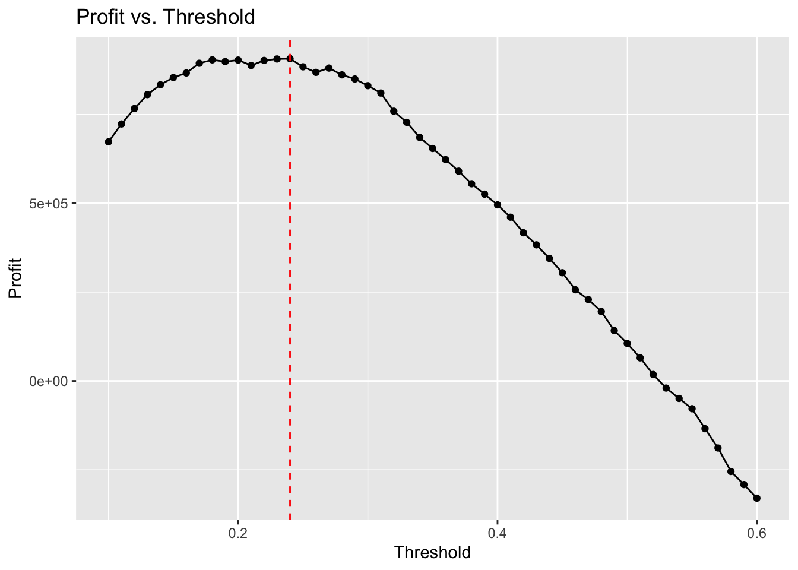
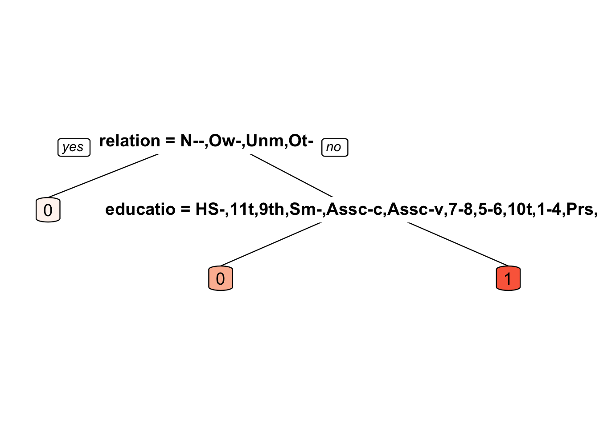
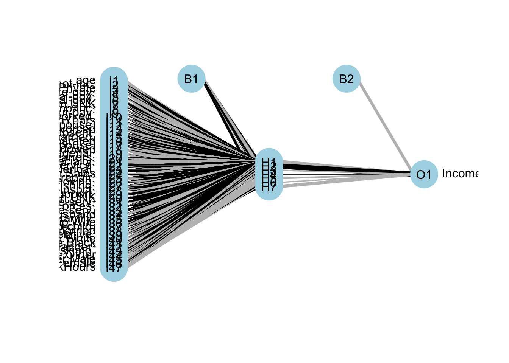
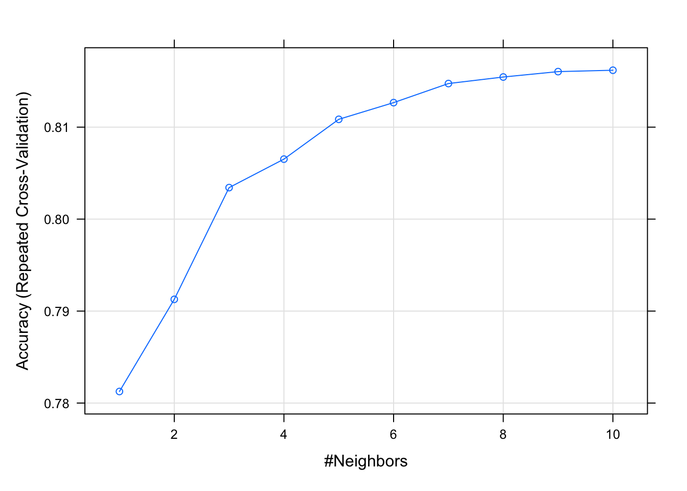
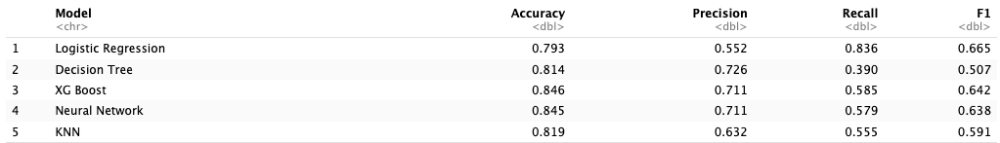
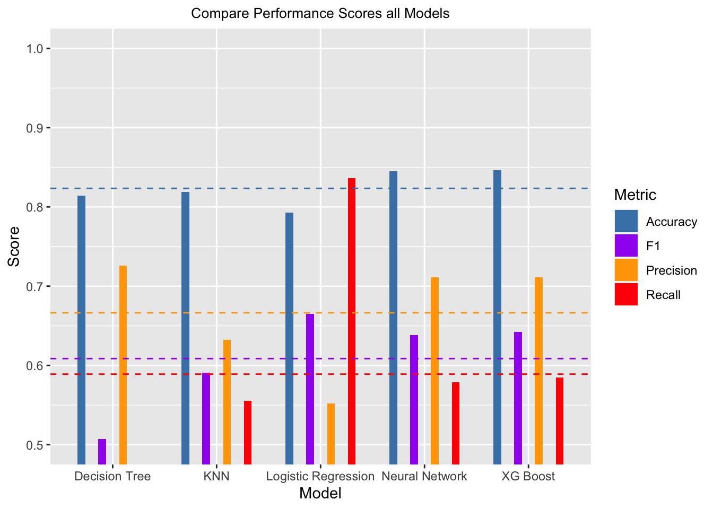
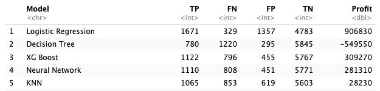
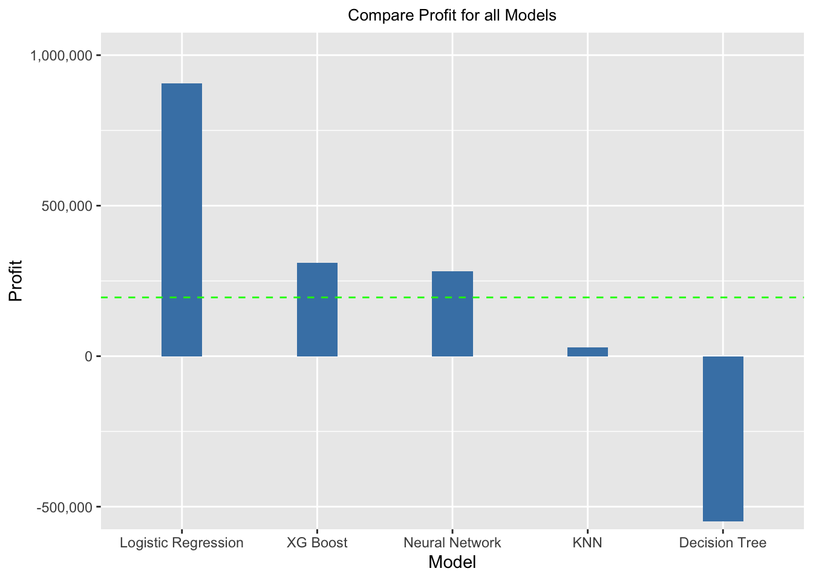

# Binary Classification for Credit-Card Applications

## Project Summary

This project aims to develop a predictive model for a credit card company to extend credit card offers to individuals with a projected income above $50,000. The objective is to maximize profit by accurately identifying true positives and true negatives while minimizing the costs associated with false positives and false negatives.

### Situation
A credit card company targets only individuals with an income above $50,000 to extend credit card offers, making income the key determinant in the predictive modeling.

### Goal
The goal is to maximize profit considering the lifetime value of a credit card customer and the costs associated with false predictions.

  * The benefit of a true positive is equal to the lifetime value of a credit card customer, estimated to be $1400
  * If you incorrectly give a person a credit card (false positive) and the person defaults, and it goes into collection then you can lose not only the principal but also have a cost of collection. This is estimated to be a loss of $1200
  * Not issuing a card to a person who would have been a good customer (false negative) is an opportunity lost. Missing out this opportunity costs $800
  * Not issuing a card to someone who did not deserve one (true negative) saves some minor processing benefit of $10.

## Data Description
The dataset comprises 48842 instances split into training (32561 instances) and test (16281 instances) sets, featuring both continuous and discrete attributes from demographic and financial domains. 25% of the training data was split off for validation.

## Models Evaluated
- Logistic Regression
- Decision Tree
- XGBoost
- Neural Network
- K-Nearest Neighbors (KNN)

## Model Evaluation and Selection
The data was split into a 75% training set and a 25% validation set. Models were evaluated based on precision, recall, F1 and the profit achieved on the validation set.

Each model was tested and tuned. The results achieved on the validation set were used to select the best model. The chosen model was then used on an unseen and unlabeled test data set and the results were submitted to a competition.

---

**Logistic Regression Profit Curve**

---

**Decision Tree Structure**
   

---

**Neural Network Structure**
   

---

**KNN Performance Curve**
   

---

**Model Performance Scores**

---

---

**Cost-Benefit Analysis and Profit**

---

---

## Competition Results

The model that was chosen for the competition was Logistic regression. The regression model had the highest recall score which resulted in the highest profit level on the validation set. Thus, the logistic regression model was used on the unseen test data to produce a list of binary classifications that were submitted to the competition.

The results from the Logistic Regression model on the unseen test data which was submitted to the competition resulted in:

- Profit: $697,350

- TN: 9635

- FP: 2800

- FN: 647

- TP: 3199
